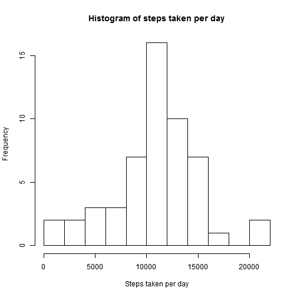
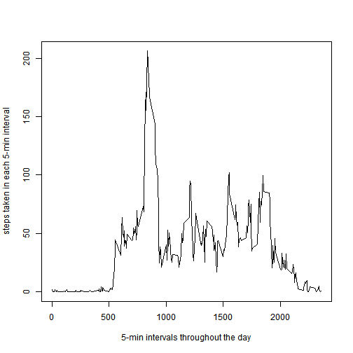
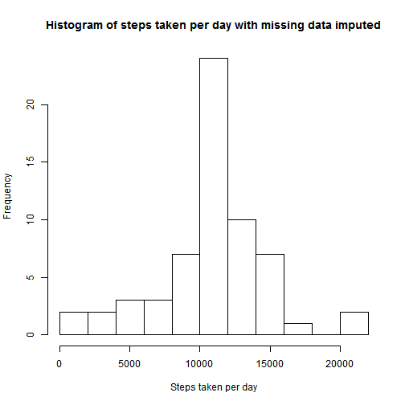
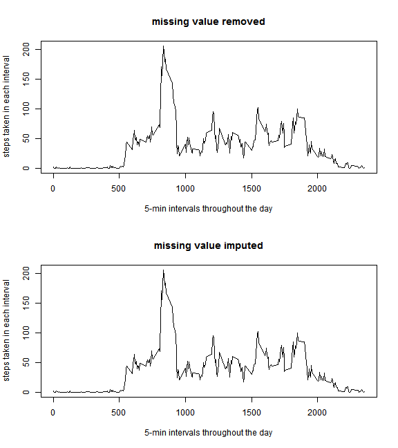
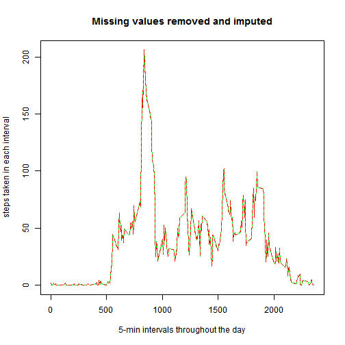
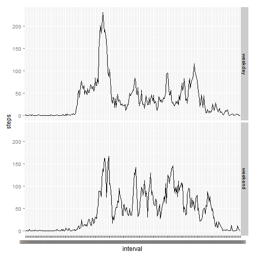

This is an R Markdown document for Reproducible Research assignment 1.

### 1. Load the libraries and data, and preprocess the data

```r
library(dplyr)
library(stringr)
library(ggplot2)

ac<-read.csv("activity.csv")

# pad the left side of the interval entry "0" with "so that each entry has four characters
ac$interval<-str_pad(ac$interval,4,"left","0")

datetime<-strptime(paste(ac$date,ac$interval), "%Y-%m-%d %H%M")

# create a new data frame "acdatetime" by adding column "datetime" to the data frame
acdatetime<-cbind(ac,datetime)

# a data frame with missing value removed
steps_datetime<-filter(acdatetime,steps!="NA")
```


### 2.What is mean total number of steps taken per day?


```r
by_day<-group_by(steps_datetime,date)
sumbyday<-summarise_each(by_day,funs(sum),steps)
hist(sumbyday$steps,breaks=10,main="Histogram of steps taken per day",xlab="Steps taken per day")
```

 

```r
print(summary(sumbyday$steps))
```

```
##    Min. 1st Qu.  Median    Mean 3rd Qu.    Max. 
##      41    8841   10760   10770   13290   21190
```

The mean total number of steps taken per day is 10766.


### 3. What is the average daily activity pattern?

```r
pattern<-group_by(steps_datetime,interval)
avgbyinterval<-summarise_each(pattern,funs(mean),steps)

plot(avgbyinterval$interval,avgbyinterval$steps, type="l", xlab="5-min intervals throughout the day", ylab="steps taken in each 5-min interval")
```

 

```r
ordered<-arrange(avgbyinterval,desc(steps))
maxinterval<-ordered[1,1]
maxstep<-as.integer(ordered[1,2])
```
The 5-min interval at 0835 contains the maximum number of steps: 206.


### 4. Imputing missing values
Imputing strategy: The rounded average number of steps taken per interval calculated from the data set with missing data removed will be used for that interval whenever the data is missing.

```r
# obtaining a data frame containging rounded value of the mean of steps per interval
intavgsteps<-as.integer(round(avgbyinterval$steps))
avgbyinterval<-cbind(avgbyinterval,intavgsteps)
#rename steps to mysteps to avoid column name duplication in the merged data frame
avgbyinterval<-rename(avgbyinterval, mysteps=steps)

#merge the orginal data frame with the above data frame containg the mean steps per interval
mymerge<-merge(acdatetime, avgbyinterval, by=c("interval","interval"))
mymerge<-arrange(mymerge,datetime)

# replace NA with the mean steps for that interval
mymergena<-filter(mymerge, is.na(steps)==TRUE)
mymergena$steps<-mymergena$intavgsteps
imputed<-rbind(mymergena,filter(mymerge,is.na(steps)==FALSE))

#calculate the number of missing values
num_missing<-length(mymergena$steps)

#calculate step per day for data set with missing value imputed
by_day_imputed<-group_by(imputed,date)
sumbyday_imputed<-summarise_each(by_day_imputed,funs(sum),steps)
# make a histogram with data set containing imputed data
hist(sumbyday_imputed$steps,breaks=10,main="Histogram of steps taken per day with missing data imputed",xlab="Steps taken per day")
```

 


```r
# group and summarize the data set containing imputed data
patternimputed<-group_by(imputed,interval)
avgbyintervalimputed<-summarise_each(patternimputed,funs(mean),steps)

#make plot with or without missing value imputed
par(mfrow=c(2,1))
plot(avgbyinterval$interval,avgbyinterval$mysteps, type="l",xlab="5-min intervals throughout the day", ylab="steps taken in each interval", main="missing value removed")
plot(avgbyintervalimputed$interval,avgbyintervalimputed$steps, type="l",xlab="5-min intervals throughout the day", ylab="steps taken in each interval", main="missing value imputed")
```

 

```r
par(mfrow=c(1,1))
```


The total number of missing values in the dataset is 2304.

Summary with missing data removed:

```
##    Min. 1st Qu.  Median    Mean 3rd Qu.    Max. 
##      41    8841   10760   10770   13290   21190
```
Summary with missing data imputed:

```
##    Min. 1st Qu.  Median    Mean 3rd Qu.    Max. 
##      41    9819   10760   10770   12810   21190
```
As one can see from the above data set summary, the results are very similar but not identical; therefore, imputing missing data using the way described above does not have a significant effect on the results of the estimates of the total daily number of steps. In fact, if we plot both lines in the same graph, the two lines are identical at the resolution of the current graphing scale (missing value removed-green, missing value imputed-read).


```r
plot(avgbyinterval$interval,avgbyinterval$mysteps, type="l",xlab="5-min intervals throughout the day", ylab="steps taken in each interval", main="Missing values removed and imputed",col="green")
lines(avgbyintervalimputed$interval,avgbyintervalimputed$steps,lty=2, col="red")
```

 


###5. Are there differences in activity patterns between weekdays and weekends?

```r
# use the data set with the filled-in missing data

#create a column "dayorend" to denote weekday and weekend
imputed_wd<-mutate(imputed,weekday=weekdays(datetime),dayorend="weekday")
imputed_wd$dayorend[imputed_wd$weekday=="Saturday"|imputed_wd$weekday=="Sunday"]<-"weekend"
#group the data by interval and weekday/weekend
patterndayorend<-group_by(imputed_wd,interval,dayorend)
avgdayorend<-summarise_each(patterndayorend,funs(mean),steps)

#plot the result
g<-ggplot(avgdayorend,aes(interval,steps,group=1))
print(g+geom_line()+facet_grid(dayorend~.))
```

 


Comparison of the two graphs shows that on the weekdays, the activity starts earlier and has a larger early morning peak and that, on the weekend, the activity starts later and the morning peak is less pronounce, i.e., the activity is more evenly spreaded over the course the day.
